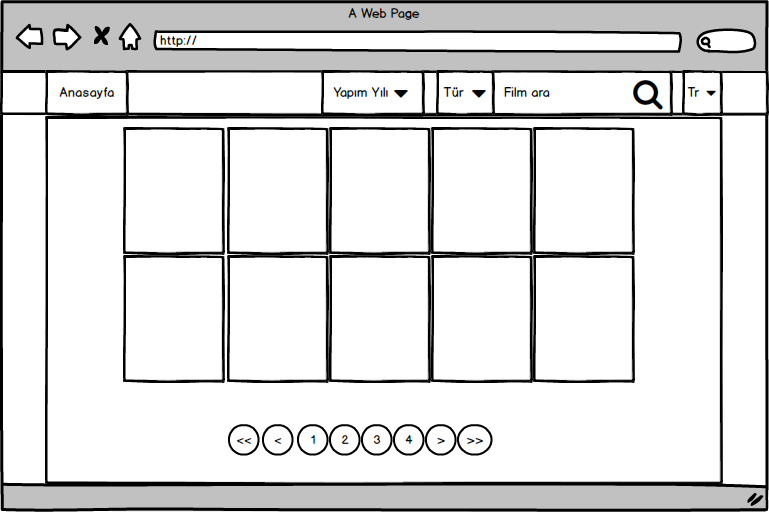
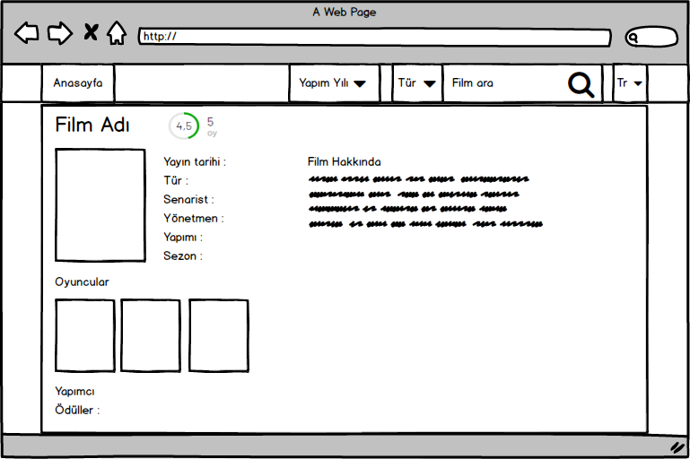

# Getting Started with Create React App

## Project Mockups

## `npm start`

Runs the app in the development mode.\
Open [http://localhost:3000](http://localhost:3000) to view it in the browser.

The page will reload if you make edits.\
You will also see any lint errors in the console.

## `npm test`

Launches the test runner in the interactive watch mode.\
See the section about [running tests](https://facebook.github.io/create-react-app/docs/running-tests) for more information.

## `npm test-live`

Launches the test runner in the interactive watch mode.\
See the section about [running tests](https://facebook.github.io/create-react-app/docs/running-tests) for more information.

## `npm run build`

Builds the app for production to the `build` folder.\
It correctly bundles React in production mode and optimizes the build for the best performance.

The build is minified and the filenames include the hashes.\
Your app is ready to be deployed!

See the section about [deployment](https://facebook.github.io/create-react-app/docs/deployment) for more information.

npm install -D typescript
npm install -D ts-node

Json Convert

-"Title": "High School Musical: The Musical - The Series",
-"imdbRating": "7.1" /10,
-"imdbVotes": "6,471",
-Film süresi "Runtime": "31 min",
-Tür "Genre": "Comedy, Drama, Musical",
-Yayın tarihi "Released": "12 Nov 2019",
-"Year": "2019–", + "Country": "United States"
-"Writer": "Tim Federle",
-Filmin konusu "Plot": "The students from the school where the High School Musical films were shot stage a musical production based on the franchise.",
-Orjinal Dil"Language": "English",
-"Poster": "https://m.media-amazon.com/images/M/MV5BNWU1N2U5NzMtNDY2YS00YTk3LWIwNjAtNDU2ZGRhZDE1NWI2XkEyXkFqcGdeQXVyMTEzMTI1Mjk3._V1_SX300.jpg",
-"imdbID": "tt8510382",
-"Type": "series",
-"totalSeasons": "3",
-"Actors": "Olivia Rodrigo, Joshua Bassett, Matt Cornett",
-"Director": "N/A",
-"Awards": "3 wins & 8 nominations",
-"Response": "True"
